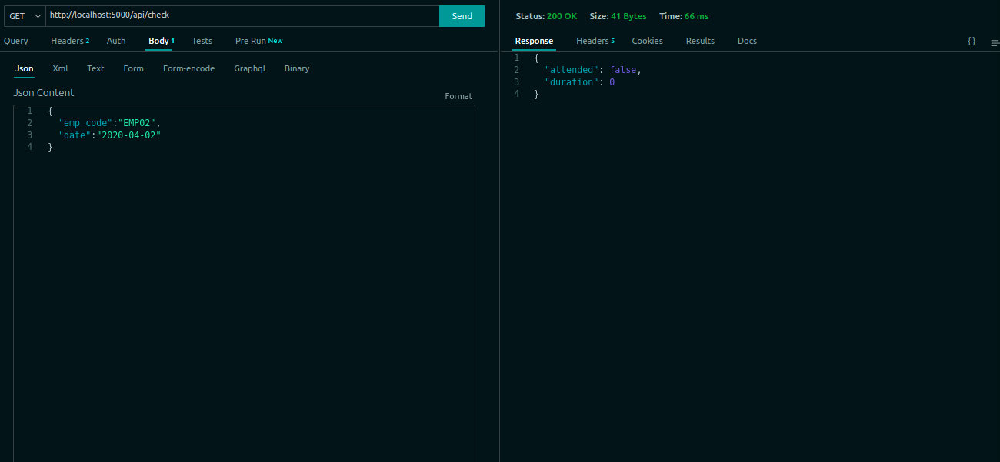
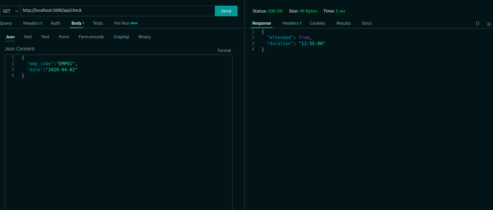
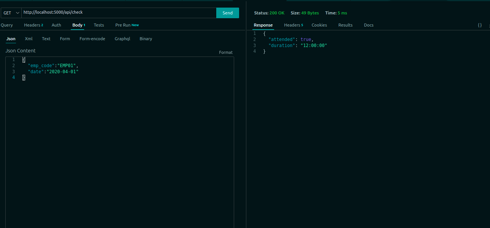
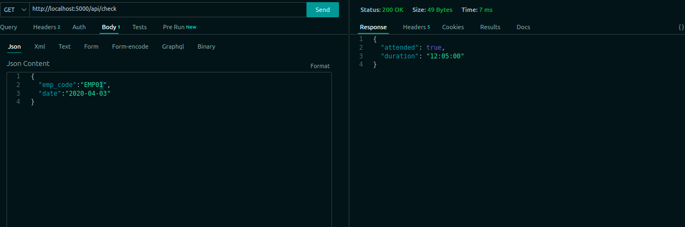
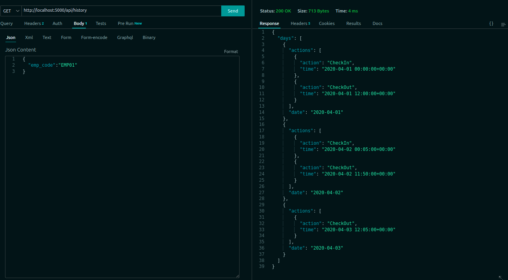

# Task docs

## Install dependencies

```bash
pip install -r requirements.txt
```

## Start Server

```bash
waitress-serve waitress_server:app
```

**OR**

```bash
python app.py
```

## Rest API

### <http://localhost:5000/api/check>

 **Emp02** didn't attend this day as there's no attendance action
 
 **Emp01**
 
 
 **Emp01** came early that day before 12 am so there's no record for chekin in that day only checkout at 12:05 pm so he attend shift with begining of the day, as the screenshot below
 

### <http://localhost:5000/api/history>

 
